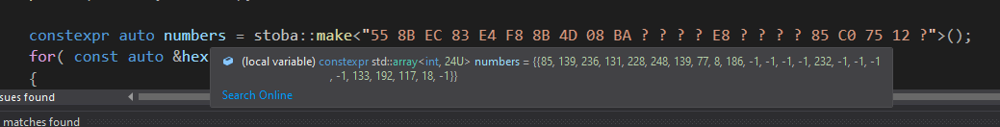

# compiletime-string-to-bytearray
For some reason you want to use strings for byte arrays? Well, here is the most performant way to do it.

# How does this look decompiled?

    

    

# Compilers
Tested and works with:
- MSVC (std:c++latest)
- LLVM Clang ((MS)std:c++latest)
